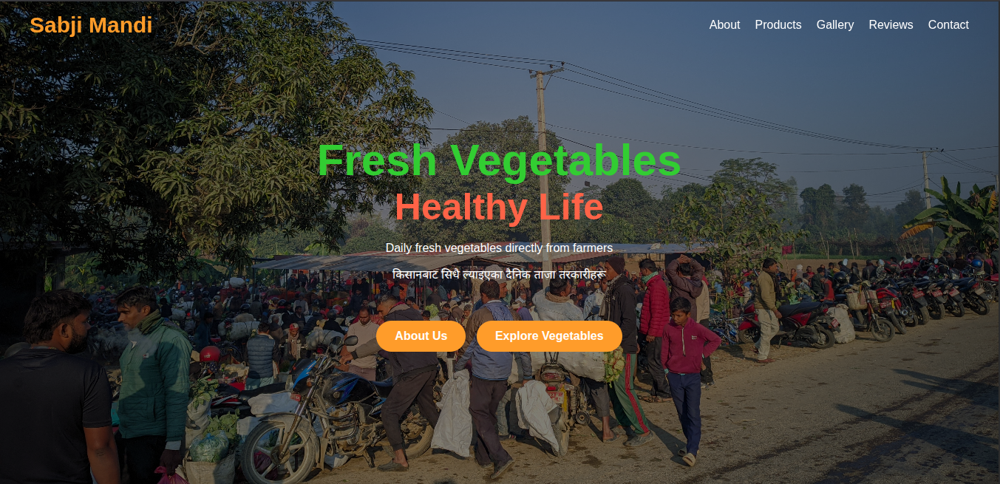
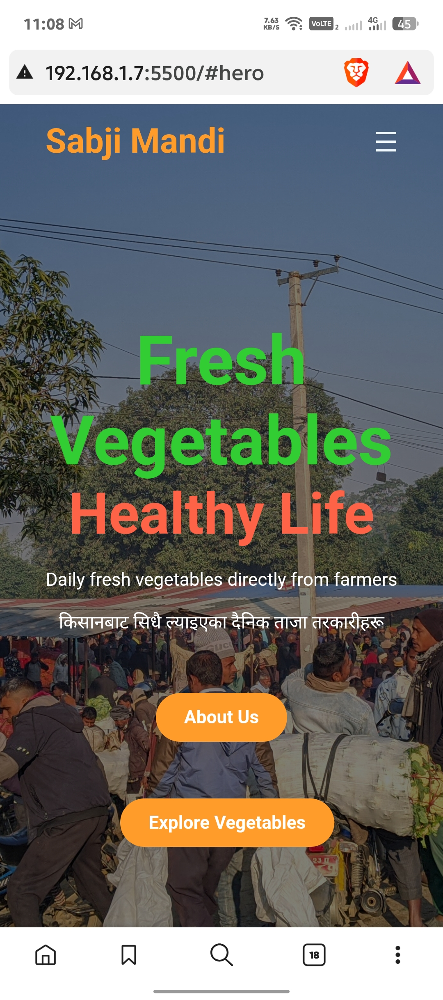
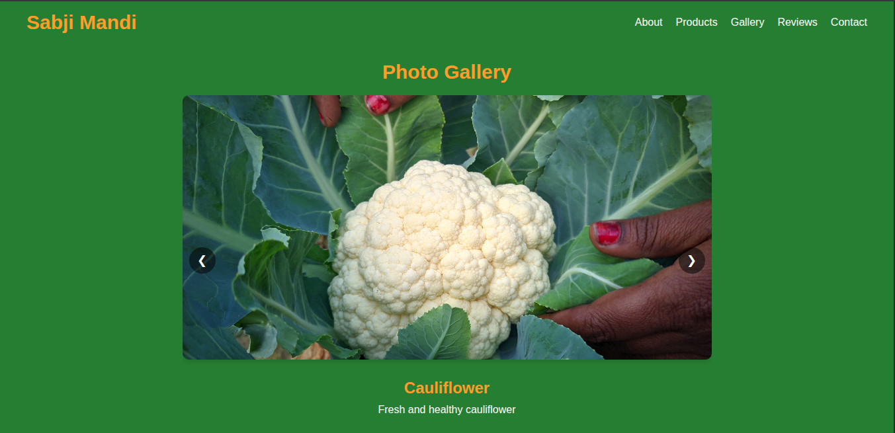

# 🥕 Sabji Mandi - Fresh Vegetables Website

[](https://developer.mozilla.org/en-US/docs/Web/HTML)
[](https://developer.mozilla.org/en-US/docs/Web/CSS)
[](https://developer.mozilla.org/en-US/docs/Web/JavaScript)
[](https://developer.mozilla.org/en-US/docs/Learn/CSS/CSS_layout/Responsive_Design)

A modern, fully responsive website for **Sabji Mandi**, a local vegetable market in Nandanagar, Nepal. Built with clean code and smooth animations, this website showcases fresh, organic vegetables directly from local farmers, featuring an interactive gallery, customer testimonials, and seamless mobile navigation.


## 🌟 Key Features

### 🎨 **Modern UI/UX Design**
- **Fresh Green Theme**: Vibrant color scheme representing freshness and nature
- **Smooth Animations**: CSS transitions and transforms for interactive elements
- **Professional Typography**: Clean, readable fonts with proper hierarchy

### 📱 **Fully Responsive Design**
- **Mobile-First Approach**: Optimized for phones, tablets, and desktops
- **Hamburger Menu**: Collapsible navigation for mobile devices
- **Adaptive Layouts**: Grid systems that adjust to screen sizes

### 🖼️ **Interactive Gallery**
- **Auto-Sliding Photos**: 4-second interval slideshow of market scenes
- **Manual Navigation**: Arrow buttons and dot indicators for user control
- **Smooth Transitions**: Seamless image transitions

### 🛒 **Product Showcase**
- **Grid Layout**: Beautiful display of fresh vegetables
- **High-Quality Images**: Local produce photography
- **Product Categories**: Organized vegetable sections

### ⭐ **Customer Reviews**
- **Star Ratings**: Visual rating system
- **Testimonials**: Customer feedback and experiences
- **Social Proof**: Building trust with reviews

### 🎯 **Interactive Elements**
- **Smooth Scrolling**: Animated navigation to sections
- **Button Effects**: Hover and click animations with scaling
- **Dynamic Header**: Background changes on scroll for better UX

### 🗺️ **Contact Integration**
- **Location Details**: Precise address in Nandanagar, Nepal
- **Google Maps Link**: Direct navigation to physical location
- **Contact Information**: Phone number for inquiries

## 🛠️ Technology Stack

| Technology | Purpose | Version |
|------------|---------|---------|
|  | Semantic Structure | HTML5 |
|  | Styling & Animations | CSS3 |
|  | Interactivity | ES6+ |
|  | Icons | Latest |

## 📁 Project Structure

```
sabji_mandi/
├── 📄 index.html              # Main HTML structure
├── 🎨 style.css               # Complete styling & responsive design
├── ⚡ script.js               # Interactive functionality
├── 🖼️ images/                 # Image assets
│   ├── 🥔 potatoes.jpg        # Product image
│   ├── 🍅 tomatoes.jpg        # Product image
│   ├── 🥬 green_vegetables.jpeg # Product image
│   └── 📁 local/              # Local market photos
│       ├── 🥦 cauliflower.jpg # Local produce
│       ├── 👥 crowd.jpg       # Market atmosphere
│       ├── 🧅 onion.jpg       # Local produce
│       └── 🥕 radish.jpg      # Local produce
└── 📖 README.md               # Project documentation
```

## 🚀 Quick Start

### Prerequisites
- ✅ Modern web browser (Chrome 90+, Firefox 88+, Safari 14+, Edge 90+)
- ✅ Internet connection (for Ionicons and Google Maps)
- ✅ Text editor (VS Code recommended)

### Installation & Setup

1. **Clone the Repository**
   ```bash
   git clone https://github.com/your-username/sabji-mandi.git
   cd sabji-mandi
   ```

2. **Open in Browser**
   ```bash
   # For local development, use a local server
   python3 -m http.server 8000
   # Or simply open index.html in your browser
   ```

3. **View the Website**
   - Open `http://localhost:8000` in your browser
   - Or double-click `index.html` for direct viewing

## 📖 Usage Guide

### 🧭 Navigation
- **Desktop**: Use the top navigation menu for smooth scrolling
- **Mobile**: Tap the hamburger (☰) menu for navigation options
- **Smooth Scrolling**: All navigation links animate to sections

### 🖼️ Gallery Interaction
- **Auto-Play**: Images change every 4 seconds automatically
- **Manual Control**: Use ◀️ ▶️ arrows or dots below images
- **Touch-Friendly**: Swipe on mobile devices

### 📱 Mobile Experience
- **Responsive Menu**: Hamburger menu appears on screens < 768px
- **Touch Interactions**: Optimized button sizes and spacing
- **Fast Loading**: Optimized images and minimal dependencies

### 🎯 Interactive Features
- **Button Animations**: "About Us" and "Explore Vegetables" buttons scale on hover/click
- **Header Effects**: Background changes when scrolling past hero section
- **Hover States**: Visual feedback on all interactive elements

## 🎨 Design System

### Color Palette
```css
Primary Green: #267e32    /* Main background */
Accent Orange: #ff9c2a    /* Buttons, highlights */
Lime Green: limegreen     /* Headings */
Dark Orange: #cc7a00      /* Button click state */
White: #ffffff           /* Text on dark backgrounds */
```

### Typography
- **Primary Font**: Poppins (Google Fonts)
- **Fallback**: Sans-serif
- **Sizes**: Responsive scaling (16px - 60px)

### Animations
- **Duration**: 0.3s for smooth transitions
- **Easing**: ease-in-out for natural feel
- **Effects**: Scale transforms, background changes, opacity fades

## 📱 Browser Support

| Browser | Version | Status |
|---------|---------|--------|
| Chrome | 90+ | ✅ Full Support |
| Firefox | 88+ | ✅ Full Support |
| Safari | 14+ | ✅ Full Support |
| Edge | 90+ | ✅ Full Support |
| Mobile Safari | iOS 14+ | ✅ Full Support |
| Chrome Mobile | Android 90+ | ✅ Full Support |

## 📞 Contact & Location

**🏪 Sabji Mandi**  
Gaidahawa-7, Nandanagar  
Nepal 🇳🇵

- **📞 Phone**: +977 9800759606
- **🗺️ Maps**: [View Location](https://maps.app.goo.gl/RahfAbVwPrhojjrx7)
- **⏰ Hours**: Daily fresh delivery

## 👨‍💻 Developer

**Nitesh Kumar Lodh**  
Full-Stack Developer & UI/UX Enthusiast

[](https://niteshkumarlodh-portfolio.pages.dev/)
[](https://www.linkedin.com/in/niteshkumarlodh/)
[](https://github.com/niteshkumar8848)

## 📄 License

This project is licensed under the **MIT License** - see the [LICENSE](LICENSE) file for details.

```text
MIT License - feel free to use this project for learning and commercial purposes.
```

## 🤝 Contributing

We welcome contributions! Here's how you can help:

### Ways to Contribute
- 🐛 **Bug Reports**: Found an issue? [Open an issue](https://github.com/your-username/sabji-mandi/issues)
- ✨ **Feature Requests**: Have ideas? Share them!
- 🔧 **Code Improvements**: Submit pull requests
- 📖 **Documentation**: Help improve this README

### Development Setup
```bash
# Fork the repository
# Clone your fork
git clone https://github.com/your-username/sabji-mandi.git
cd sabji-mandi

# Create feature branch
git checkout -b feature/amazing-feature

# Make changes and test
# Commit your changes
git commit -m 'Add amazing feature'

# Push to branch
git push origin feature/amazing-feature

# Open Pull Request
```

## 📸 Screenshots

### Desktop View


### Mobile View


### Gallery Section


## 🙏 Acknowledgments

- **Local Farmers**: For providing fresh, organic vegetables
- **Ionicons**: For beautiful, free icons
- **Google Fonts**: For the Poppins typography
- **Open Source Community**: For inspiration and tools

---

<div align="center">

**🌱 Bringing Fresh Vegetables from Farm to Table 🌱**

*Made with ❤️ in Nepal 🇳🇵*

[⭐ Star this repo](https://github.com/niteshkumar8848/Sabji-Mandi) • [🐛 Report Issues](https://github.com/niteshkumar8848/Sabji-Mandi/issues) • [📧 Contact Developer](mailto:niteshkumarlodh@gmail.com)

</div>